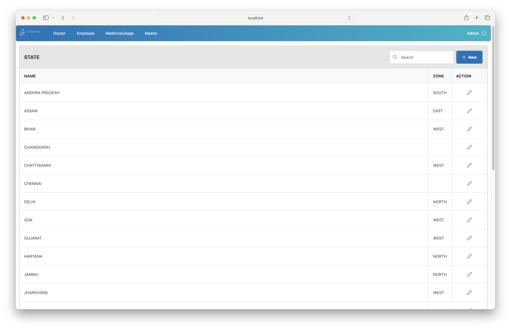

# Haemat Human Resource Module

A comprehensive web-based admin panel for managing doctors, employees, medicine usage, and healthcare metadata such as zones, states, regions, and specialities. Designed for efficiency, visibility, and seamless access control for medical teams.

## 🚀 Features

- 🔐 **Secure Authentication** (Login screen)
- 👨‍⚕️ **Doctor Management**
  - Add/Edit/Delete doctors
  - Assign doctors to employees
  - Control visibility and metadata like speciality, hospital, and state
- 👨‍💼 **Employee Management**
  - CRUD operations on employee data
  - Designation, zones, regions, and activation status
  - View assigned doctors
- 💊 **Medicine Usage Tracking**
  - Detailed medicine records by doctor and employee
  - Capture order dates, vials, PAP values, and indications
- 🛠️ **Masters Configuration**
  - Speciality, Designation, Zone, State, and Region CRUD
  - Admin-only metadata configuration
- 🔍 **Advanced Search & Filters**
  - Search and pagination for every module
  - Inline editable tables
- ✅ **Visibility and Activation Toggle**
  - One-click activation/deactivation for users and metadata

## 🖥️ Screenshots

| Module | Preview |
|--------|---------|
| Login |  |
| Doctor List |  |
| Add Doctor |  |
| Edit Doctor |  |
| Employee List |  |
| View Doctors by Employee |  |
| Assign/Unassign Doctor |  |
| Medicine Usage |  |
| Master - Designation |  |
| Master - Zone |  |
| Master - State |  |
| Master - Region |  |
| Master - Speciality |  |

> 📁 All 25 screenshots should be added to a `/screenshots` directory in your repo for these references to work.

## 🧱 Tech Stack

- **Frontend:** HTML, CSS, JavaScript
- **Framework:** React (assumed)
- **State Handling:** Inline table state editing
- **Backend:** Node.js / Express (assumed)
- **Database:** Likely MongoDB or SQL-based (inferred from UI structures)
- **Authentication:** Custom login system

## 📦 Setup & Installation

  # Clone the repository
  git clone https://github.com/ajayvishwakarma457/Haemat-Human-Resource-Module.git
  cd Haemat-Human-Resource-Module
  
  # Install dependencies
  npm install
  
  # Setup environment variables (DB config, AWS keys, etc.)
  
  # Run the app
  npm run dev
  
  ## 📬 Contact
  **Author:** Ajay M Vishwakarma  
  **Email:** ajayvishwakarma457@gmail.com

